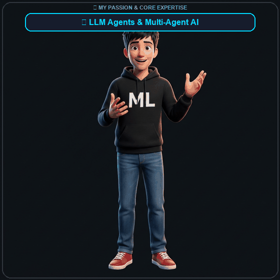

<!-- Animated Header -->

<!-- Typing animation -->

<!-- Social Badges -->
 

 

---

  

## 🧠 About Me

<table width="100%">
<tr>
<td width="52%" valign="top" style="padding: 16px;">

### 👋 Hi, I'm Jeevan!

🎯 **Data Scientist & AI/ML Engineer** with **2+ years** of experience

📍 India 🇮🇳 &nbsp;|&nbsp; 💼 Open to Opportunities

---

### 🚀 What I Do
- 🤖 Build **production-grade LLM Agents** & Agentic Workflows
- 🔗 Architect **RAG Pipelines** with vector search & embedding models
- 📊 Develop **Predictive Analytics** & decision-support models
- 🏥 Deliver **Healthcare AI** & CRM automation solutions
- ⚡ **Cut manual effort by 40–70%** through intelligent automation
- 🎯 **Improved data accuracy by 30%** and supported 500+ users

---

> 💼 *Skilled in data preparation, feature engineering, statistical analysis, model validation, and end-to-end delivery from discovery to deployment. Works with business stakeholders to turn operational problems into measurable analytical solutions.*

</td>
<td width="48%" valign="middle" align="center" style="padding: 12px;">

</td>
</tr>
</table>

---

## 🛠️ Tech Stack & Skills

### 🤖 AI / ML & LLM Ecosystem

### 🧪 ML Frameworks & Data Science

### 🗄️ Vector Databases & Storage

### 🌐 Backend & Web

### ☁️ DevOps & Cloud

---

## 💼 Experience

<table width="100%">
<tr>
<td width="50%" valign="top">

### 🚀 Current Focus
- 🤖 **LLM Agent Development** — Building autonomous agents with LangGraph & LangChain for complex, multi-step reasoning tasks
- 🔗 **RAG Pipelines** — Designing retrieval-augmented generation systems with vector databases for knowledge-intensive applications
- 🏥 **Healthcare AI** — Developing intelligent CRM systems for HCP (Healthcare Professional) interaction tracking
- 📊 **Predictive Modeling** — Building end-to-end ML pipelines from data ingestion to model deployment

</td>
<td width="50%" valign="top">

### 🎯 Core Expertise
| Domain | Proficiency |
|--------|------------|
| LLM Agents & RAG | ████████████ Expert |
| Python & ML | ████████████ Expert |
| LangChain/LangGraph | ███████████░ Adv. |
| FastAPI / React | █████████░░░ Prof. |
| Deep Learning | █████████░░░ Prof. |
| Cloud & DevOps | ███████░░░░░ Inter. |

</td>
</tr>
</table>

---

## 🚀 Featured Projects

<table>
<tr>
<td width="50%" valign="top">

### 🏥 [AIVOA-CRM-HCP](https://github.com/vakajeevanreddy/AIVOA-CRM-HCP)
> **AI-Powered Healthcare CRM**

AI-powered CRM system for documenting Healthcare Professional (HCP) interactions. Built with a **React** frontend and **FastAPI** backend, enabling intelligent interaction logging, analytics, and workflow automation for medical sales teams.

**Tech Stack:**

</td>
<td width="50%" valign="top">

### 🧠 [Customer Health Care CRM App](https://github.com/vakajeevanreddy/Customer_Health_care_crm_app)
> **Intelligent Customer Analytics**

End-to-end ML-powered CRM app for customer health care management. Combines predictive analytics with intelligent data pipelines for actionable healthcare insights.

**Tech Stack:**

</td>
</tr>
<tr>
<td width="50%" valign="top">

### 📚 [SkC_Jeevan_Tutor](https://github.com/vakajeevanreddy/SkC_Jeevan_Tutor)
> **Interactive Python Learning Platform**

A web-based Python learning tutorial application offering an interactive and user-friendly experience. Designed for beginners with structured lessons, live coding environments, and progress tracking.

**Tech Stack:**

</td>
<td width="50%" valign="top">

### 🏠 [California House Price Prediction](https://github.com/vakajeevanreddy/California_house_price_pred)
> **ML Regression Model**

End-to-end machine learning project predicting California housing prices using advanced regression techniques. Includes EDA, feature engineering, model tuning and evaluation.

**Tech Stack:**

</td>
</tr>
<tr>
<td width="50%" valign="top">

### 🤖 [Deep Learning Projects](https://github.com/vakajeevanreddy/Deeplearning_projects)
> **Neural Network Experiments**

A collection of deep learning experiments and implementations including CNNs, RNNs, transformers and more. Covers computer vision, NLP, and sequence modeling tasks.

**Tech Stack:**

</td>
<td width="50%" valign="top">

### 📐 [Deep-ML Practice](https://github.com/vakajeevanreddy/deep-ml)
> **ML Algorithm Implementation**

Hands-on machine learning practice solutions and labs from Deep-ML platform. Implements ML algorithms from scratch to build a deep understanding of the mathematical foundations.

**Tech Stack:**

</td>
</tr>
</table>

---

## 📊 GitHub Stats

 

---

## 🏆 GitHub Achievements

---

## 📈 Contribution Graph

---

## 🌐 Connect With Me

&nbsp;

&nbsp;

  

> 💬 *"The best way to predict the future is to build it."*
>
> Open to **AI/ML roles**, **LLM engineering** opportunities, and **interesting collaborations**. Let's connect! 🤝

---

